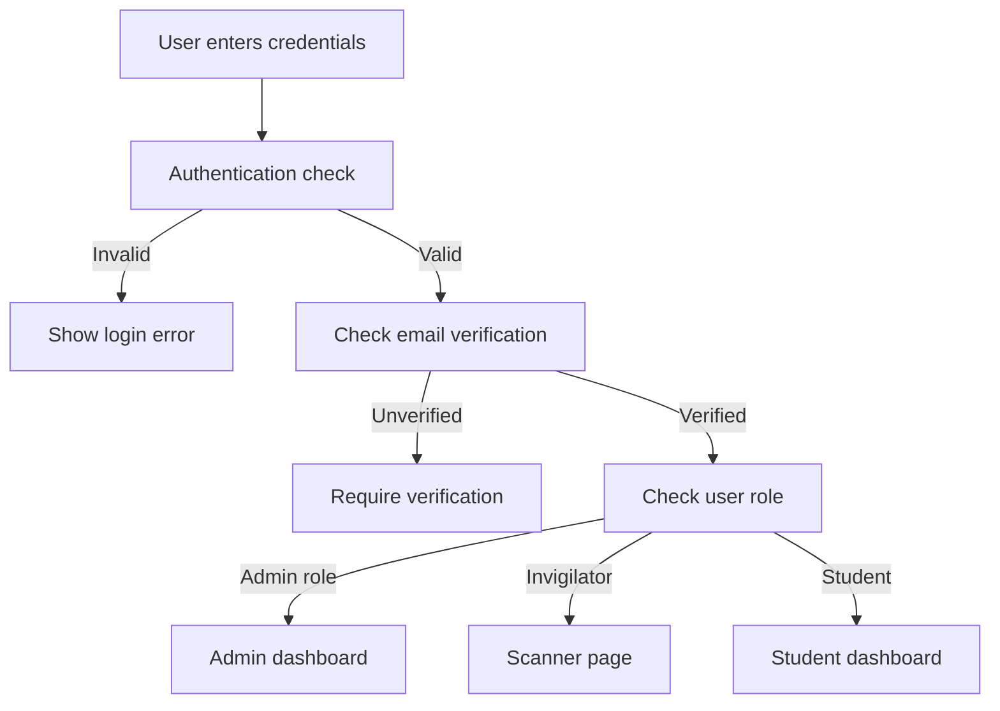
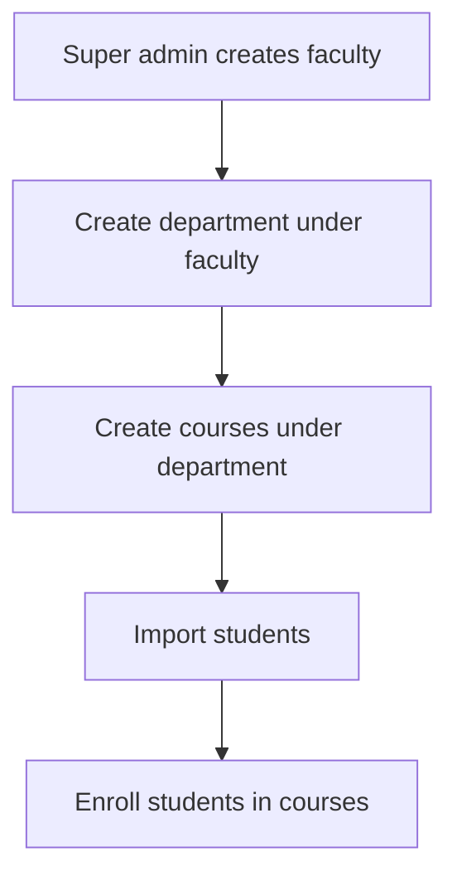
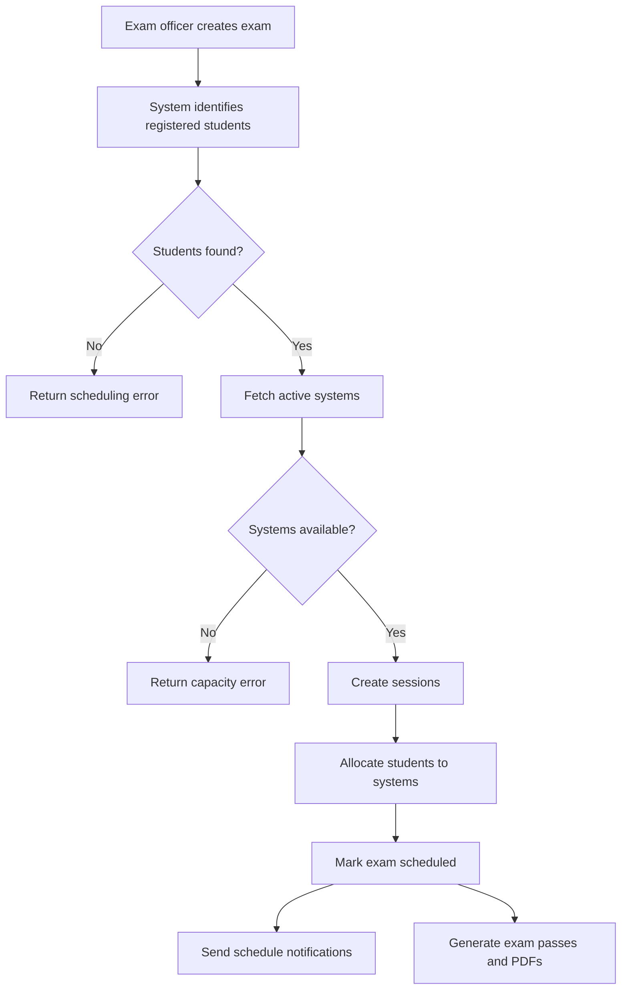
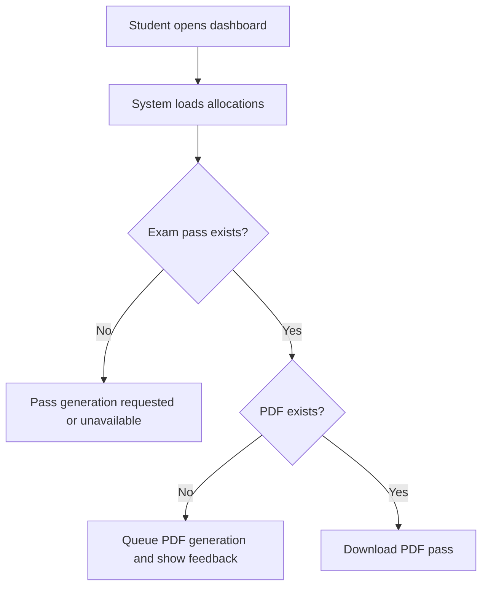
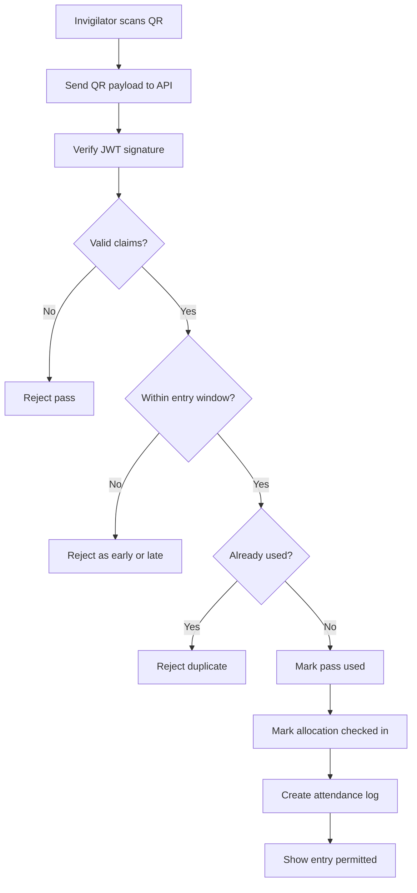
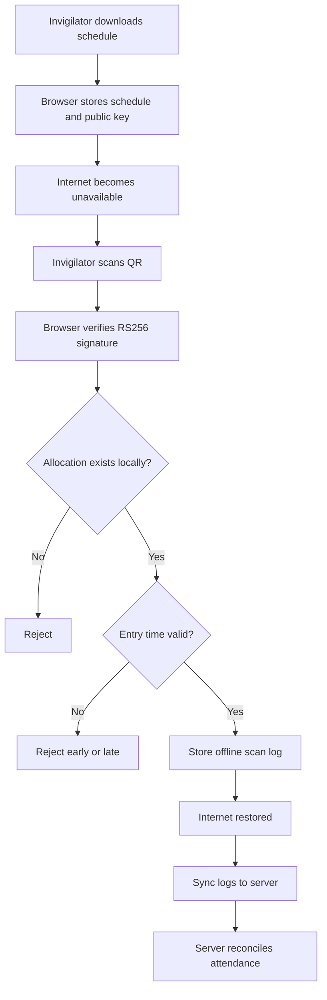
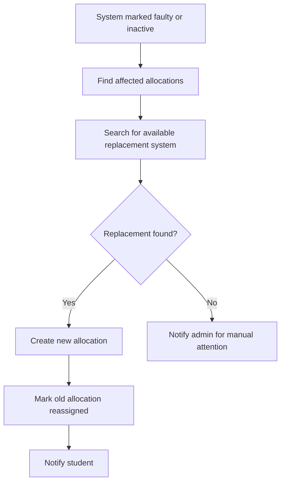
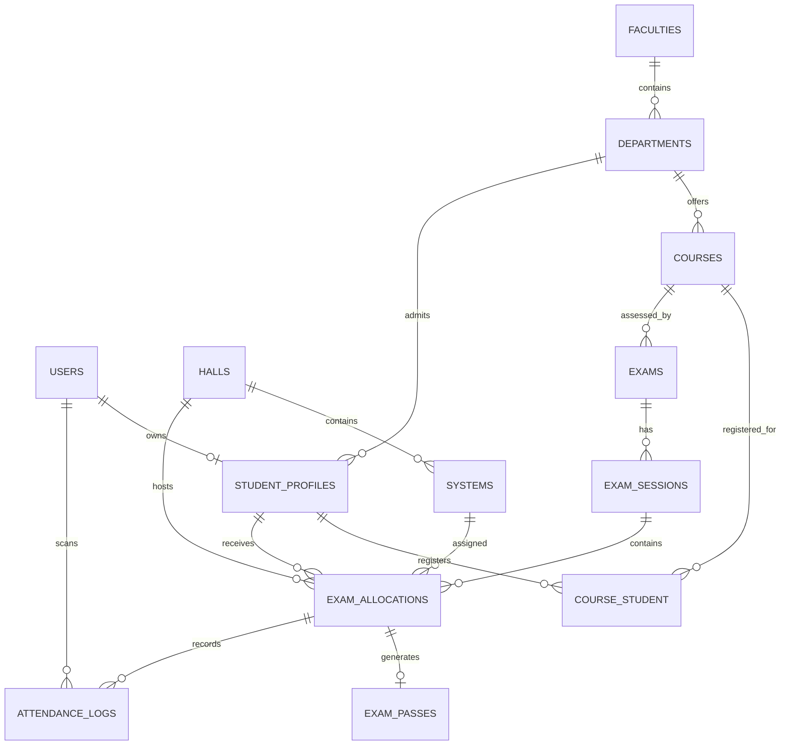

# MXSchedule: Academic Project Documentation

## Title

**Design and Implementation of a Secure Computer-Based Examination Scheduling, Seat Allocation, Exam Pass, and Attendance Validation System**

## Abstract

MXSchedule is a web-based examination management system designed to automate the administration of computer-based examinations in a tertiary institution. The system addresses common operational problems such as manual seating allocation, examination hall capacity planning, course-based student registration, late communication of examination schedules, unreliable attendance validation, and limited support for offline invigilation. The application provides role-based modules for super administrators, examination officers, ICT administrators, invigilators, and students.

The system is implemented with the Laravel framework and follows a modular service-oriented application structure. It uses relational database modeling for academic structures, examination sessions, systems, allocations, attendance logs, notifications, and audit records. It also implements queue-based processing for expensive operations such as schedule generation, PDF pass generation, and notification dispatch. Security mechanisms include role-based access control, signed QR code exam passes, RSA-based offline verification, password reset links for imported accounts, email OTP verification during registration, throttled validation APIs, audit logging, and controlled lifecycle transitions.

This document presents a comprehensive academic analysis of the application, including problem definition, objectives, requirements, system design, architecture, database design, activity flows, security mechanisms, implementation details, testing approach, deployment concerns, limitations, and recommendations for future enhancement.

## Table of Contents

1. Introduction
2. Background and Problem Statement
3. Aim and Objectives
4. Scope of the System
5. Stakeholders and User Roles
6. Functional Requirements
7. Non-Functional Requirements
8. System Analysis
9. System Architecture
10. Module Design
11. Activity Flows
12. Database Design
13. Security Design and Implementation
14. Email and Notification Design
15. Queue, Cron, and Background Processing
16. Offline Invigilation Design
17. User Interface Design
18. Testing and Validation
19. Deployment Considerations
20. Limitations
21. Recommendations and Future Work
22. Conclusion

## 1. Introduction

Examination administration in institutions with computer-based testing centers involves multiple interdependent activities. Students must be registered for courses, exams must be created for those courses, halls and computer systems must be available, candidates must be assigned fairly to systems, exam passes must be issued, and invigilators must validate candidates at entry. Where these activities are handled manually, the process is prone to delays, duplication, over-allocation, impersonation, miscommunication, and weak auditability.

MXSchedule provides an integrated solution for managing these workflows. It combines academic structure management, student import, course registration, hall and system management, automatic exam scheduling, exam pass generation, QR code validation, offline attendance capture, notifications, monitoring, reporting, and audit logging.

The application is particularly useful in contexts where institutions conduct computer-based examinations across multiple halls and sessions, and where invigilators may experience temporary connectivity issues during candidate validation.

## 2. Background and Problem Statement

Many examination offices still rely on spreadsheets, manual allocation lists, and printed attendance sheets. These methods can work for small examinations but become unreliable when candidate population, hall count, course count, and exam sessions increase.

Typical problems include:

- Students being allocated to unavailable or faulty systems.
- More candidates being assigned to a hall than the hall capacity permits.
- Repeated use of the same system in overlapping sessions.
- Students not receiving timely information about their exam venue and system.
- Difficulty verifying whether an exam pass is authentic.
- Invigilators being unable to validate students when internet access is unstable.
- Manual attendance records being difficult to reconcile after the exam.
- Lack of audit trails for administrative actions.
- Poor visibility into no-shows, system usage, load distribution, and attendance outcomes.

MXSchedule addresses these issues by providing a centralized, secure, role-based, and auditable system.

## 3. Aim and Objectives

### 3.1 Aim

The aim of this project is to design and implement a secure web-based examination scheduling and attendance validation system for computer-based examinations.

### 3.2 Objectives

The specific objectives are:

1. To model institutional academic structures such as faculties, departments, courses, and students.
2. To allow administrators to create and manage examination halls and computer systems.
3. To import student records and course registrations through CSV files.
4. To create exams based on academic session, semester, course, date, time, and duration.
5. To automatically generate exam sessions based on available system capacity.
6. To allocate students fairly and non-deterministically to available computer systems.
7. To generate secure exam passes with signed QR code payloads.
8. To allow students to view and download their exam passes.
9. To allow invigilators to validate exam passes online and offline.
10. To record attendance and prevent duplicate entry.
11. To send relevant email and in-app notifications.
12. To provide administrative reporting and monitoring.
13. To enforce role-based access control and maintain audit logs.

## 4. Scope of the System

The system covers the following activities:

- User registration and authentication.
- Email OTP verification during account creation.
- Admin-created user accounts with secure password setup links.
- Faculty and department management.
- Course management.
- Student CSV import and course enrollment.
- Hall and system management.
- Exam creation and editing.
- Automatic schedule generation.
- Seat and system allocation.
- Exam pass generation and PDF download.
- QR code attendance validation.
- Offline schedule download and offline scan synchronization.
- Exam reminder notifications.
- Reallocation when systems become faulty or inactive.
- Reports for attendance, missed exams, load distribution, and system usage.
- System settings and audit logs.

The system does not directly conduct the computer-based test itself. Its primary role is examination logistics, candidate placement, identity/pass validation, attendance tracking, and administrative reporting.

## 5. Stakeholders and User Roles

### 5.1 Super Administrator

The super administrator has full access to the system. Responsibilities include:

- Managing users and roles.
- Managing faculties and departments.
- Managing global settings.
- Viewing audit logs.
- Managing all academic and examination data.
- Overseeing reports and administrative workflows.

### 5.2 Examination Officer

The examination officer manages academic and exam workflows. Responsibilities include:

- Creating courses and exams.
- Importing students and enrollments.
- Triggering schedule generation.
- Viewing allocations.
- Sending schedule notifications.
- Reassigning students when needed.
- Viewing reports.

### 5.3 ICT Administrator

The ICT administrator manages physical infrastructure. Responsibilities include:

- Creating halls.
- Adding systems to halls.
- Updating system status.
- Marking systems active, inactive, or faulty.
- Supporting reallocation when systems become unavailable.

### 5.4 Invigilator

The invigilator validates students at exam entry. Responsibilities include:

- Scanning QR codes on exam passes.
- Entering QR payloads manually when necessary.
- Downloading offline schedules.
- Validating candidates offline when internet connectivity is unavailable.
- Synchronizing offline attendance logs.
- Viewing attendance information where permitted.

### 5.5 Student

The student is the examination candidate. Responsibilities include:

- Logging in to the student dashboard.
- Viewing registered and scheduled exams.
- Downloading exam passes.
- Presenting valid exam passes at the exam venue.
- Reading notifications and reminders.

## 6. Functional Requirements

### 6.1 Authentication and Account Management

- The system shall allow users to register and log in securely.
- The system shall send OTP codes for account verification during account creation.
- The system shall allow administrators to create accounts.
- The system shall send secure password setup links instead of temporary passwords.
- The system shall allow authenticated users to update their password.
- The system shall redirect users to the correct dashboard based on role.

### 6.2 Academic Structure Management

- The system shall allow super administrators to create faculties.
- The system shall allow super administrators to create departments under faculties.
- The system shall allow authorized users to create and manage courses.
- Each course shall belong to a department.

### 6.3 Student and Enrollment Management

- The system shall allow authorized users to import students using CSV.
- The system shall validate CSV data before import.
- The system shall create or update student profiles.
- The system shall enroll students into courses for an academic session and semester.
- The system shall prevent duplicate course registration for the same session and semester.

### 6.4 Hall and System Management

- The system shall allow ICT administrators to create halls.
- Each hall shall have a capacity and active status.
- The system shall allow bulk creation of systems in a hall.
- The system shall prevent system creation above hall capacity.
- The system shall allow system status updates.
- The system shall maintain status logs for system changes.

### 6.5 Examination Management

- The system shall allow authorized users to create exams for courses.
- Each exam shall have an academic session, semester, date, start time, duration, and buffer time.
- The system shall allow exam edits before scheduling constraints prevent unsafe changes.
- The system shall maintain exam lifecycle states such as draft, scheduling, scheduled, in progress, completed, and cancelled.

### 6.6 Schedule Generation

- The system shall generate exam sessions based on the number of registered students and available systems.
- The system shall not allocate students to unavailable systems.
- The system shall avoid overlapping system usage.
- The system shall create allocations for students, sessions, halls, and systems.
- The system shall dispatch notification and pass-generation jobs after successful scheduling.

### 6.7 Exam Pass Generation

- The system shall generate one exam pass per allocation.
- The system shall sign QR payloads with RS256 when RSA keys exist.
- The system shall store PDF exam passes on the public disk.
- The system shall allow students to download exam passes.
- The system shall queue PDF generation where necessary.

### 6.8 Attendance Validation

- The system shall allow invigilators to validate QR codes online.
- The system shall verify QR signatures and allocation claims.
- The system shall reject expired, duplicate, early, late, or invalid passes.
- The system shall update allocation status on successful validation.
- The system shall create attendance logs for validation attempts.

### 6.9 Offline Mode

- The system shall allow invigilators to download selected exam schedules.
- The system shall allow multiple downloaded schedules to be stored in browser local storage.
- The system shall provide the RSA public key for browser-side signature verification.
- The system shall validate QR codes offline using the Web Crypto API.
- The system shall store offline scans locally.
- The system shall synchronize offline logs with the server when online.

### 6.10 Notifications

- The system shall notify users when accounts are created.
- The system shall send OTP verification emails.
- The system shall notify students when schedules are released.
- The system shall send exam reminders before exam sessions.
- The system shall notify students when seats are reallocated.
- The system shall notify administrators when jobs fail.
- The system shall send CSV import summaries.

### 6.11 Reports and Monitoring

- The system shall provide attendance reports.
- The system shall provide missed exam reports.
- The system shall provide load distribution reports.
- The system shall provide system usage reports.
- The system shall support report export where permitted.

## 7. Non-Functional Requirements

### 7.1 Security

The system must protect authentication, authorization, QR validation, student data, and administrative operations.

### 7.2 Reliability

The system must use transactions for sensitive operations such as scheduling and attendance validation.

### 7.3 Availability

The invigilator module must support offline validation when internet access is unstable.

### 7.4 Performance

Schedule generation and notification dispatch should run through queues to avoid blocking user requests.

### 7.5 Usability

The user interface should provide clear feedback for long-running operations, validation failures, and successful actions.

### 7.6 Maintainability

The codebase should use controllers for request handling, services for domain logic, jobs for background work, and models for persistence.

### 7.7 Auditability

Administrative changes and attendance events should be traceable through logs and database records.

## 8. System Analysis

### 8.1 Existing Manual System

In a manual examination allocation process, students are typically registered through spreadsheets, halls are assigned manually, systems are counted by hand, and attendance is recorded on paper. This approach creates several weaknesses:

- High probability of human error.
- Poor scalability for large student populations.
- Weak security around pass authenticity.
- Slow reallocation when systems fail.
- No real-time attendance visibility.
- Difficult post-exam reporting.

### 8.2 Proposed System

The proposed system digitizes the workflow and enforces business rules through software. Students are linked to courses, courses are linked to exams, exams are linked to generated sessions, and sessions are linked to system allocations. Exam passes are generated from allocations, and attendance is validated through signed QR codes.

### 8.3 Advantages of the Proposed System

- Automated capacity-aware scheduling.
- Reduced allocation conflicts.
- Secure QR-based pass validation.
- Offline validation capability.
- Role-based administrative separation.
- Email and database notifications.
- Audit trails and reports.
- Better student communication.
- Improved operational transparency.

## 9. System Architecture

MXSchedule follows a layered Laravel architecture.

```mermaid
flowchart TD
    U["Users: Admins, Invigilators, Students"] --> UI["Blade, Livewire, Alpine.js UI"]
    UI --> R["Web and API Routes"]
    R --> C["Controllers"]
    C --> S["Domain Services"]
    S --> M["Eloquent Models"]
    M --> DB["Relational Database"]
    S --> Q["Queue Jobs"]
    Q --> N["Notifications and PDF Generation"]
    C --> API["Scanner and Offline APIs"]
    API --> LS["Browser Local Storage and Web Crypto"]
```



### 9.1 Presentation Layer

The presentation layer is built with Laravel Blade templates, Livewire components, and Alpine.js interactions. It includes:

- Admin dashboard and management screens.
- Student dashboard and exam pass screens.
- Invigilator scanner interface.
- Authentication and profile screens.
- PDF exam pass template.

### 9.2 Routing Layer

The route layer maps user actions to controllers. It defines:

- Public welcome route.
- Authenticated dashboard redirection.
- Admin routes under `/admin`.
- Invigilator routes under `/invigilator`.
- Student routes under `/student`.
- API routes under `/api/v1`.

### 9.3 Controller Layer

Controllers handle HTTP requests and delegate business logic to services. Examples include:

- `Admin\ExamController`
- `Admin\ScheduleController`
- `Admin\CsvImportController`
- `Admin\HallController`
- `Api\QrValidationController`
- `Api\OfflineSyncController`
- `Invigilator\ScannerController`
- `Student\ExamPassController`

### 9.4 Service Layer

The service layer contains core business logic:

- `SchedulingEngine`: schedule generation and allocations.
- `ExamPassService`: QR payload and PDF pass generation.
- `QrValidationService`: online and offline scan reconciliation.
- `CsvImportService`: student and enrollment imports.
- `ExamRegistrationService`: registered student retrieval.
- `ReallocationService`: system failure and manual reallocation.
- `ReportService`: administrative reporting.
- `SystemManagementService`: system state management.

### 9.5 Persistence Layer

The persistence layer uses Laravel Eloquent models and migrations to manage the relational database. Main entities include users, student profiles, courses, halls, systems, exams, sessions, allocations, passes, attendance logs, settings, and audit logs.

### 9.6 Background Processing Layer

Long-running work is delegated to queues:

- Schedule generation.
- Schedule release notifications.
- Exam pass PDF generation.
- Failure notifications.

### 9.7 Notification Layer

The notification layer uses Laravel notifications through mail and database channels.

## 10. Module Design

### 10.1 Authentication Module

This module handles login, registration, verification, password reset, and password update. Laravel Breeze, Livewire, and standard Laravel authentication infrastructure are used.

Key security features:

- Password hashing.
- Email verification.
- Password reset tokens.
- OTP verification during account creation.
- Authenticated-only dashboards.

### 10.2 Academic Structure Module

This module manages faculties, departments, and courses.

Hierarchy:

```text
Faculty -> Department -> Course
```

Courses are required before exams can be created. Departments are required before students can be imported.

### 10.3 Student Import and Registration Module

Students can be imported through CSV. The expected student CSV columns include:

- `name`
- `email`
- `matric_number`
- `department_code`
- `level`
- `courses`
- `academic_session`
- `semester`

The `courses` column supports pipe-separated course codes, for example:

```text
CSE301|CSE401|GST201
```

The module performs:

- Header normalization.
- Formula-injection stripping.
- Email and field validation.
- Department lookup.
- User creation or update.
- Student profile creation or update.
- Course enrollment.
- Password setup notification.

### 10.4 Hall and System Module

This module manages physical CBT infrastructure. A hall has a capacity and multiple systems. A system has a unique code and a status.

System statuses include:

- Active.
- Inactive.
- Faulty.

The application uses natural sorting for system codes so values such as `HC11` and `HC100` are ordered correctly.

### 10.5 Exam Management Module

An exam belongs to a course and is configured with:

- Academic session.
- Semester.
- Exam date.
- Start time.
- Duration.
- Buffer minutes.
- Status.
- Notes.

Only students registered for the exam course, academic session, and semester are eligible for allocation.

### 10.6 Scheduling Module

The scheduling module is implemented primarily by `SchedulingEngine`.

The scheduling process:

1. Confirm the exam is schedulable.
2. Mark exam status as scheduling.
3. Fetch registered students for the exam course.
4. Confirm active systems exist.
5. Delete previous sessions for the exam when regenerating.
6. Shuffle students using `random_int`.
7. Compute session start and end times.
8. Fetch available systems that do not overlap with existing allocations.
9. Create exam sessions.
10. Allocate students to systems.
11. Mark the exam as scheduled.
12. Dispatch schedule notifications.
13. Dispatch exam pass PDF generation.

### 10.7 Exam Pass Module

Each exam allocation may have one exam pass. The pass contains:

- A unique pass code.
- A signed QR payload.
- Expiry timestamp.
- PDF path.
- Used status.

The QR payload contains claims such as:

- Issuer.
- Audience.
- Student profile ID.
- Allocation ID.
- Exam session ID.
- Pass identifier.
- Issue time.
- Expiry time.

### 10.8 Invigilator Scanner Module

The scanner module supports:

- Camera-based QR scanning.
- Manual QR payload entry.
- Live server validation.
- Offline validation.
- Recent scan history.
- Offline schedule download.
- Offline attendance synchronization.

### 10.9 Reporting Module

The reporting module supports administrative insight into:

- Attendance.
- Missed exams.
- Load distribution.
- System usage.

### 10.10 Settings Module

Settings include:

- Entry window minutes.
- Delayed reveal hours.
- QR signing key fallback.
- Academic session.
- Current semester.
- Pass grace minutes.
- Exam reminder hours.

## 11. Activity Flows

### 11.1 User Login and Dashboard Flow



### 11.2 Academic Setup Flow



### 11.3 Exam Scheduling Flow



### 11.4 Student Exam Pass Flow



### 11.5 Online QR Validation Flow



### 11.6 Offline Validation Flow



### 11.7 Reallocation Flow



## 12. Database Design

### 12.1 Entity Overview

The database is relational and organized around academic, infrastructure, examination, security, and reporting entities.

### 12.2 Core Entities

| Entity | Purpose |
|---|---|
| users | Stores authentication identity and account information. |
| faculties | Stores top-level academic faculties. |
| departments | Stores departments under faculties. |
| courses | Stores courses under departments. |
| student_profiles | Stores matric number, department, and level for student users. |
| course_student | Stores student course registrations by session and semester. |
| halls | Stores CBT halls and capacities. |
| systems | Stores individual computer systems under halls. |
| exams | Stores exam definitions. |
| exam_sessions | Stores generated sessions for exams. |
| exam_allocations | Stores student-seat-system assignments. |
| exam_passes | Stores signed QR payloads and PDF references. |
| attendance_logs | Stores scan attempts and attendance outcomes. |
| system_status_logs | Stores status changes for systems. |
| system_audit_logs | Stores administrative audit records. |
| settings | Stores configurable system settings. |
| notifications | Stores in-app database notifications. |
| jobs | Stores queued jobs. |
| exam_reminder_logs | Prevents duplicate reminder notifications. |

### 12.3 Entity Relationship Diagram



### 12.4 Important Tables

#### faculties

| Field | Description |
|---|---|
| id | Primary key. |
| name | Faculty name. |
| code | Unique faculty code. |
| timestamps | Creation and update time. |

#### departments

| Field | Description |
|---|---|
| id | Primary key. |
| faculty_id | Foreign key to faculties. |
| name | Department name. |
| code | Unique department code. |
| timestamps | Creation and update time. |

#### courses

| Field | Description |
|---|---|
| id | Primary key. |
| department_id | Foreign key to departments. |
| code | Unique course code. |
| title | Course title. |
| credit_units | Credit unit value. |
| timestamps | Creation and update time. |

#### student_profiles

| Field | Description |
|---|---|
| id | Primary key. |
| user_id | Unique foreign key to users. |
| matric_number | Unique matriculation number. |
| department_id | Foreign key to departments. |
| level | Student level. |
| timestamps | Creation and update time. |

#### course_student

| Field | Description |
|---|---|
| course_id | Course registered by the student. |
| student_profile_id | Student profile. |
| academic_session | Session such as 2025/2026. |
| semester | Semester such as first or second. |

Unique constraint:

```text
course_id + student_profile_id + academic_session + semester
```

This prevents duplicate registration for the same course in the same academic period.

#### halls

| Field | Description |
|---|---|
| name | Hall name. |
| code | Unique hall code. |
| location | Optional physical location. |
| capacity | Maximum number of systems/candidates. |
| is_active | Hall availability flag. |

#### systems

| Field | Description |
|---|---|
| hall_id | Hall where the system is located. |
| system_code | Unique system identifier. |
| label | Optional descriptive label. |
| status | Active, inactive, or faulty. |
| status_note | Reason or note for status. |
| last_used_at | Last time the system was used. |

#### exams

| Field | Description |
|---|---|
| course_id | Course being examined. |
| academic_session | Academic session. |
| semester | Semester. |
| exam_date | Exam date. |
| duration_minutes | Duration of each session. |
| buffer_minutes | Gap between sessions. |
| start_time | Initial start time. |
| total_registered_students | Cached number of registered students. |
| status | Draft, scheduling, scheduled, in progress, completed, etc. |
| scheduled_at | Time scheduling completed. |
| scheduled_by | User who triggered scheduling. |
| notes | Optional notes. |
| softDeletes | Allows non-destructive deletion. |

#### exam_sessions

| Field | Description |
|---|---|
| exam_id | Parent exam. |
| session_number | Sequential session number. |
| start_time | Session start date and time. |
| end_time | Session end date and time. |
| max_capacity | Available capacity for that session. |
| allocated_count | Number of allocated students. |
| status | Pending, in progress, completed, etc. |

#### exam_allocations

| Field | Description |
|---|---|
| exam_session_id | Session for allocation. |
| student_profile_id | Allocated student. |
| system_id | Assigned system. |
| hall_id | Denormalized hall for fast lookup. |
| seat_status | Allocated, checked in, completed, no-show, reassigned, etc. |
| checked_in_at | Check-in timestamp. |
| checked_in_by | Invigilator who checked student in. |
| reassigned_from_id | Link to previous allocation when reallocated. |

Important constraints:

```text
exam_session_id + student_profile_id
exam_session_id + system_id
```

These enforce one student per session and one system per session.

#### exam_passes

| Field | Description |
|---|---|
| exam_allocation_id | Unique allocation reference. |
| pass_code | Unique pass identifier. |
| qr_payload | Signed JWT payload. |
| is_used | Indicates whether pass was used. |
| used_at | Time of use. |
| pdf_path | Stored PDF path. |
| expires_at | Pass expiry time. |
| pdf_generation_requested_at | Tracks queued PDF generation requests. |

#### attendance_logs

| Field | Description |
|---|---|
| exam_allocation_id | Related allocation. |
| scanned_by | Invigilator user ID. |
| scan_result | Result such as valid, duplicate, expired, early, late. |
| scanned_at | Scan time. |
| device_info | Browser/device information. |
| ip_address | IP address. |
| synced_from_offline | Whether the log came from offline mode. |
| notes | Optional notes. |

## 13. Security Design and Implementation

### 13.1 Authentication

The system uses Laravel authentication mechanisms. Passwords are hashed, sessions are protected, and sensitive routes require authenticated access.

### 13.2 Email Verification and OTP

During account creation, the system sends a one-time password verification code by email. OTP helps confirm that a user has access to the email address used for registration.

### 13.3 Password Setup Links

For accounts created by administrators or CSV import, the system sends password setup links instead of temporary passwords. This is more secure because:

- Plain temporary passwords are not transmitted.
- Password setup links expire.
- Users choose their own password.
- Password reset tokens can be invalidated.

### 13.4 Role-Based Access Control

The system uses Spatie Laravel Permission. Access is separated by roles and permissions.

Main roles:

- `super_admin`
- `exam_officer`
- `ict_admin`
- `invigilator`
- `student`

Access control is enforced at route level using middleware such as:

- `auth`
- `verified`
- `role`
- `permission`

### 13.5 Authorization Policies

Policies are used for specific resources such as exams, halls, and exam passes. This helps ensure that users only access resources appropriate to their role and ownership.

### 13.6 Signed QR Codes

Exam pass QR payloads are signed JWTs. The system uses:

- RS256 when RSA keys exist.
- HS256 fallback for local development when RSA keys are unavailable.

For production and offline mode, RSA keys are required:

- Private key signs exam passes.
- Public key verifies exam passes.
- Browser offline verification only needs the public key.

Key generation command:

```bash
php artisan exam:generate-keys
```

### 13.7 QR Claim Binding

The QR payload is not only signed. It is also bound to database allocation data using claims:

- Allocation ID.
- Student profile ID.
- Exam session ID.
- Pass code.

During validation, these claims must match the database record. This reduces the risk of token replay against unrelated allocations.

### 13.8 Pass Expiry and Entry Window

Passes expire after the exam session end time plus a configured grace period. The entry window also prevents scans that are too early or too late.

Relevant settings:

- `entry_window_minutes`
- `pass_grace_minutes`

### 13.9 Duplicate Prevention

When a pass is successfully validated:

- The pass is marked as used.
- The allocation is marked as checked in.
- Future scans are rejected as duplicates.

The validation process uses database transactions and row locking to reduce race conditions.

### 13.10 Offline Security

Offline validation is designed around asymmetric cryptography:

- The server provides the public key.
- The browser verifies signed QR tokens using Web Crypto.
- The private key never leaves the server.
- Offline logs are synchronized later and revalidated server-side.

This design is stronger than placing an HMAC secret in the browser.

### 13.11 API Throttling

Validation and offline APIs are throttled to reduce abuse:

- QR validation API uses rate limits.
- Offline schedule and sync APIs use rate limits.

### 13.12 CSV Import Safety

CSV parsing strips leading formula injection characters such as:

```text
=+-@
```

This reduces spreadsheet formula injection risks when CSV content is later viewed or exported.

### 13.13 Audit Logging

The system stores audit logs and status logs for administrative visibility. This supports accountability and post-incident review.

### 13.14 File Storage Security

Exam keys are stored under:

```text
storage/app/keys
```

This directory is gitignored and should not be publicly accessible. The public key may be distributed, but the private key must remain secret.

## 14. Email and Notification Design

### 14.1 Notification Channels

The system uses:

- Mail notifications.
- Database notifications.

### 14.2 Notification Inventory

| Notification | Trigger | Recipient | Channel | Purpose |
|---|---|---|---|---|
| AccountCreatedNotification | Admin or CSV creates account | Created user | Mail | Sends password setup link. |
| AccountCreationOtpNotification | Registration/account creation OTP step | Registering user | Mail | Sends OTP code. |
| CsvImportSummaryNotification | CSV import completed | Uploading/admin user | Mail | Reports import results. |
| ScheduleReleasedNotification | Schedule generated | Students with allocations | Mail, database | Provides exam venue/system details. |
| ExamReminderNotification | Reminder command finds eligible sessions | Students | Mail, database | Reminds students before exams. |
| StudentReallocatedNotification | Student allocation changes | Affected student | Mail, database | Communicates new hall/system. |
| ReallocationAttentionRequiredNotification | Automatic reallocation fails | Admins | Mail, database | Requests manual intervention. |
| ExamJobFailedNotification | Schedule/PDF job fails | Admins | Mail, database | Alerts administrators of job failure. |

### 14.3 Notification Timing

Schedule notifications are sent after successful scheduling. Reminders are sent by the `exam:send-reminders` command based on configured reminder hours.

Default reminder configuration:

```text
24,1
```

This means the system may send reminders approximately 24 hours and 1 hour before an exam session.

## 15. Queue, Cron, and Background Processing

### 15.1 Queue Jobs

The system uses queue jobs for work that should not block the user interface.

| Job | Purpose |
|---|---|
| GenerateExamScheduleJob | Runs schedule generation in the background. |
| SendScheduleNotificationsJob | Sends schedule release messages. |
| GenerateExamPassPdfJob | Generates exam pass PDFs. |

### 15.2 Scheduled Commands

| Command | Purpose |
|---|---|
| exam:generate-keys | Generates RSA keys for exam QR signing. |
| exam:send-reminders | Sends configured exam reminders. |
| exam:sync-lifecycle | Advances exam/session/allocation statuses based on time. |

### 15.3 Shared Hosting Consideration

On shared hosting environments such as Hostinger, a long-running `php artisan queue:work` process may not be reliable unless supported by the hosting plan. A safer approach is often cron-driven queue processing:

```bash
php artisan queue:work --stop-when-empty
```

This can be triggered periodically by cron. The lifecycle and reminder commands should also run through cron.

Recommended cron tasks:

```bash
php artisan queue:work --stop-when-empty
php artisan exam:sync-lifecycle
php artisan exam:send-reminders
```

## 16. Offline Invigilation Design

### 16.1 Motivation

Exam venues may experience poor connectivity. If validation depends entirely on live server access, invigilators may be unable to admit students. Offline mode solves this by allowing selected exam schedules and public verification keys to be downloaded before the exam.

### 16.2 Offline Schedule Download

An invigilator selects a scheduled exam and downloads:

- Exam ID.
- Course label.
- Exam date.
- Session count.
- Allocation count.
- Allocations.
- Entry window.

The browser stores the downloaded data in local storage.

### 16.3 Public Key Download

The browser downloads the RSA public key from the server. This public key verifies QR signatures offline. If the key is missing, administrators must run:

```bash
php artisan exam:generate-keys
```

### 16.4 Offline Scan Storage

When offline, validated scan logs are stored locally. Each log includes:

- Allocation ID.
- QR payload.
- Scan timestamp.

### 16.5 Synchronization

When the device comes back online, the invigilator clicks sync attendance. The server revalidates the logs before accepting them. Accepted logs are removed from local storage, while failed logs remain for review or retry.

### 16.6 Offline Mode Limitation

Offline validation cannot know whether a student was already scanned on another device while offline. The server resolves final conflicts during synchronization.

## 17. User Interface Design

### 17.1 Design Goals

The UI is designed to be:

- Role-aware.
- Mobile-friendly.
- Clear during long-running operations.
- Explicit about errors and success messages.
- Suitable for administrative data entry.

### 17.2 Admin UI

The admin area provides dashboards and CRUD pages for:

- Halls.
- Systems.
- Courses.
- Exams.
- Users.
- Academic structure.
- Import.
- Reports.
- Settings.
- Audit logs.

### 17.3 Student UI

The student dashboard provides:

- Registered/scheduled exam visibility.
- Exam pass viewing.
- Exam pass download.
- Notifications.

### 17.4 Invigilator UI

The invigilator interface provides:

- QR scanner.
- Manual QR input.
- Online/offline status.
- Exam schedule dropdown.
- Download selected schedule action.
- Sync attendance action.
- Pending offline scan count.
- Recent scans.

### 17.5 PDF Pass UI

The exam pass is intentionally simple and black-and-white for printing. It includes:

- Student name.
- Matric number.
- Course.
- Date and time.
- Hall.
- System.
- QR code.
- Pass metadata.

## 18. Testing and Validation

### 18.1 Test Strategy

The application includes Pest feature tests and domain workflow tests. Testing focuses on:

- Authentication.
- Email verification.
- Password reset.
- Profile updates.
- Hall management.
- Exam management.
- User management.
- Student exam pass download.
- Invigilator scanner page.
- Natural sorting of systems.
- Domain workflows such as QR validation and attendance.
- Email notifications.

### 18.2 Validation Areas

Critical validation areas include:

- CSV import data.
- Hall capacity enforcement.
- Exam time format.
- Schedule generation prerequisites.
- QR payload authenticity.
- Duplicate attendance scans.
- Offline sync reconciliation.
- Role and permission restrictions.

### 18.3 Known Local Testing Constraint

The project requires PHP `^8.3`. If the local CLI uses PHP 8.2, Artisan tests cannot boot because Composer platform checks fail. In that case, syntax checks may pass, but full automated tests require PHP 8.3 or higher.

## 19. Deployment Considerations

### 19.1 Environment Requirements

The application requires:

- PHP 8.3 or newer.
- Composer.
- MySQL or compatible relational database.
- Node.js and npm for frontend builds.
- Mail configuration.
- Queue configuration.
- Writable storage directories.

### 19.2 Required Setup Commands

Typical setup:

```bash
composer install --no-dev --optimize-autoloader
php artisan key:generate
php artisan migrate --force
php artisan db:seed --force
php artisan exam:generate-keys
npm install
npm run build
php artisan storage:link
php artisan config:cache
php artisan route:cache
php artisan view:cache
```

### 19.3 Production Key Warning

The RSA private key must be protected. It should never be committed to source control or exposed through the public web root.

### 19.4 Queue Processing

Production must run the queue so schedule generation, pass generation, and notifications are processed.

For shared hosting, cron-based queue processing may be used:

```bash
php artisan queue:work --stop-when-empty
```

### 19.5 Mail Configuration

The following workflows depend on correct mail settings:

- OTP verification.
- Password setup links.
- Schedule release notification.
- Exam reminders.
- Reallocation messages.
- Job failure alerts.
- CSV import summaries.

## 20. Limitations

1. Offline validation cannot detect scans performed on other offline devices until synchronization.
2. Queue processing depends on hosting support or reliable cron configuration.
3. The scheduling algorithm assumes system availability and operating hours configured in code.
4. The system currently manages exam logistics, not the actual delivery of exam questions.
5. Offline schedule data stored in browser local storage may be lost if the browser storage is cleared.
6. If RSA keys are generated after passes were already created with HMAC fallback, those passes should be regenerated for offline compatibility.
7. Large PDF batches may require careful queue timeout and memory configuration.

## 21. Recommendations and Future Work

### 21.1 Improved Analytics

Future work may include dashboards for:

- Hall utilization trends.
- Department-level attendance performance.
- Peak capacity analysis.
- Repeat no-show patterns.

### 21.2 Stronger Offline Device Management

Offline mode can be improved by:

- Registering invigilator devices.
- Encrypting offline schedules in browser storage.
- Adding offline log signatures.
- Providing device-specific sync audit trails.

### 21.3 Advanced Scheduling Rules

Future scheduling enhancements may include:

- Department grouping or separation rules.
- Accessibility accommodations.
- Priority scheduling.
- Conflict checks across multiple courses for the same student.
- Configurable operating hours.

### 21.4 Notification Preferences

Students and administrators may be allowed to configure:

- Email preferences.
- SMS integration.
- Push notifications.
- Reminder timing.

### 21.5 External Integrations

The system may integrate with:

- Student information systems.
- Learning management systems.
- Institutional single sign-on.
- SMS gateways.
- Biometric attendance devices.

### 21.6 Enhanced Audit and Compliance

Future compliance features may include:

- Immutable audit logs.
- Exportable audit reports.
- Admin action approval workflows.
- Data retention policies.

## 22. Conclusion

MXSchedule provides a comprehensive solution for managing computer-based examination logistics in a tertiary institution. It digitizes academic setup, student registration, hall and system management, exam scheduling, pass generation, attendance validation, notifications, and reporting.

The system's most significant technical contributions are its automated capacity-aware scheduling engine, secure QR-based exam pass validation, offline invigilation support through RSA public key verification, and role-based administrative workflow. By combining Laravel's authentication, authorization, queue, notification, and database features with domain-specific scheduling and validation logic, the application improves reliability, transparency, and security in examination administration.

While the system already addresses many real-world operational issues, future improvements can expand analytics, external integrations, offline device security, and advanced scheduling constraints. Overall, MXSchedule demonstrates how a modern web application can solve a practical institutional problem through structured system analysis, secure software design, and careful implementation.

## Appendix A: Major Source Components

| Area | Important Files |
|---|---|
| Routes | `routes/web.php`, `routes/auth.php`, `routes/console.php` |
| Scheduling | `app/Services/SchedulingEngine.php`, `app/Jobs/GenerateExamScheduleJob.php` |
| Pass generation | `app/Services/ExamPassService.php`, `app/Jobs/GenerateExamPassPdfJob.php` |
| QR validation | `app/Services/QrValidationService.php`, `app/Http/Controllers/Api/QrValidationController.php` |
| Offline mode | `app/Http/Controllers/Api/OfflineSyncController.php`, `resources/views/invigilator/scanner.blade.php` |
| CSV import | `app/Services/CsvImportService.php`, `app/Http/Controllers/Admin/CsvImportController.php` |
| Reallocation | `app/Services/ReallocationService.php`, `app/Http/Controllers/Admin/ReallocationController.php` |
| Reports | `app/Services/ReportService.php`, `app/Http/Controllers/Admin/ReportController.php` |
| Notifications | `app/Notifications/*` |
| Database schema | `database/migrations/*` |
| Roles and permissions | `database/seeders/RolesAndPermissionsSeeder.php` |

## Appendix B: Suggested Project Chapter Structure

For a formal master's project report, this documentation can be expanded into the following chapters:

1. Introduction
2. Literature Review
3. System Analysis and Methodology
4. System Design
5. Implementation
6. Testing and Evaluation
7. Summary, Conclusion, and Recommendation

## Appendix C: Sample Research Contributions

Possible contributions of this project include:

- A capacity-aware algorithm for assigning candidates to computer-based exam systems.
- A secure QR-based exam pass model for candidate validation.
- An offline-first invigilation workflow using asymmetric cryptography.
- A role-based administrative platform for exam logistics.
- An auditable attendance and reallocation mechanism for CBT environments.
