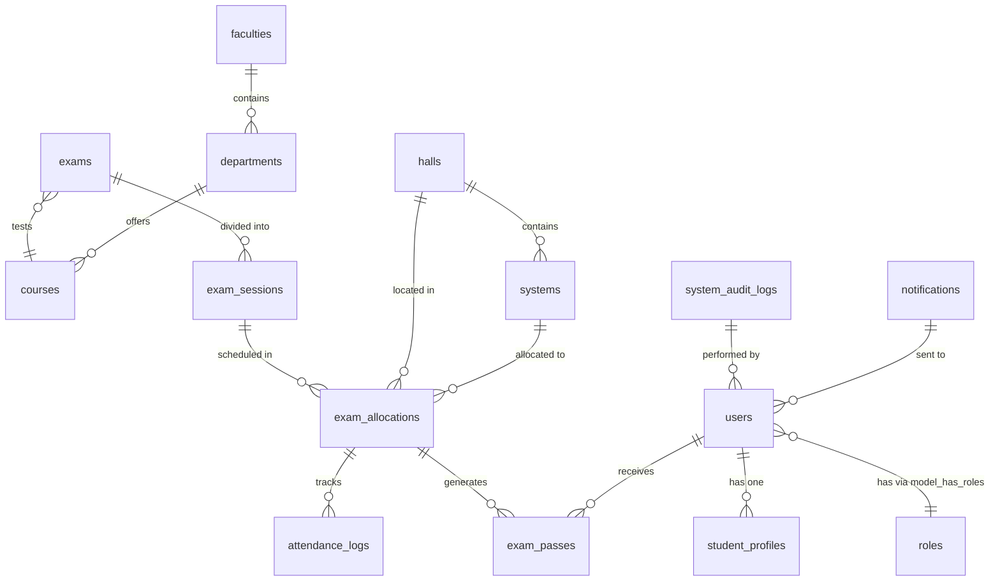
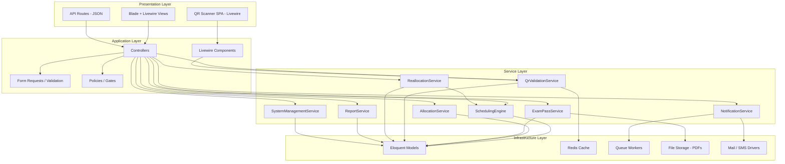
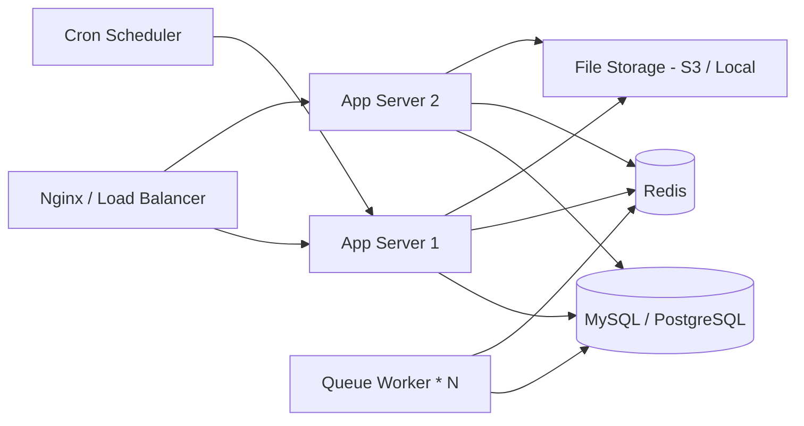
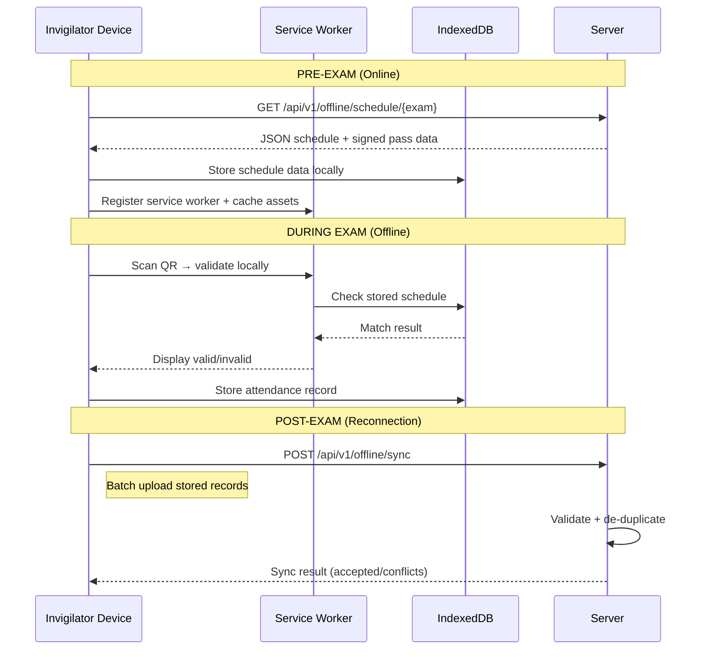
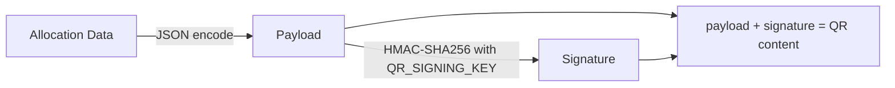

# Smart Exam Scheduling & Allocation Platform — System Design

> **Stack**: Laravel 13 · PHP 8.3 · MySQL/PostgreSQL · Blade + Livewire · Redis · Spatie Permission · DomPDF

---

## Table of Contents

1. [Database Schema](#1-database-schema)
2. [System Architecture](#2-system-architecture)
3. [Scheduling Algorithm](#3-scheduling-algorithm)
4. [API Structure](#4-api-structure)
5. [Role / Permission Matrix](#5-role--permission-matrix)
6. [UI/UX Flow Descriptions](#6-uiux-flow-descriptions)
7. [Deployment Considerations](#7-deployment-considerations)
8. [Edge Cases & Failure Handling](#8-edge-cases--failure-handling)
9. [Offline Mode Architecture](#9-offline-mode-architecture)
10. [Security Considerations](#10-security-considerations)
11. [Implementation Phases](#11-implementation-phases)

---

## 1. Database Schema

### Entity Relationship Diagram



### Tables

#### `users`
Standard Laravel users table, extended for all roles.

| Column | Type | Notes |
|---|---|---|
| `id` | `bigint PK` | |
| `name` | `varchar(255)` | |
| `email` | `varchar(255) UNIQUE` | |
| `email_verified_at` | `timestamp NULL` | |
| `password` | `varchar(255)` | |
| `phone` | `varchar(20) NULL` | For SMS notifications |
| `is_active` | `boolean DEFAULT true` | Soft disable |
| `remember_token` | `varchar(100) NULL` | |
| `timestamps` | | |
| `soft_deletes` | | |

#### `student_profiles`
Extended data for users with the `student` role.

| Column | Type | Notes |
|---|---|---|
| `id` | `bigint PK` | |
| `user_id` | `bigint FK → users` | UNIQUE |
| `matric_number` | `varchar(30) UNIQUE` | e.g. `20/52HA001` |
| `department_id` | `bigint FK → departments` | |
| `level` | `smallint` | 100, 200, 300… |
| `timestamps` | | |

#### `faculties`

| Column | Type | Notes |
|---|---|---|
| `id` | `bigint PK` | |
| `name` | `varchar(255)` | |
| `code` | `varchar(10) UNIQUE` | e.g. `ENG` |
| `timestamps` | | |

#### `departments`

| Column | Type | Notes |
|---|---|---|
| `id` | `bigint PK` | |
| `faculty_id` | `bigint FK → faculties` | |
| `name` | `varchar(255)` | |
| `code` | `varchar(10) UNIQUE` | e.g. `CSC` |
| `timestamps` | | |

#### `courses`

| Column | Type | Notes |
|---|---|---|
| `id` | `bigint PK` | |
| `department_id` | `bigint FK → departments` | |
| `code` | `varchar(20) UNIQUE` | e.g. `CSC301` |
| `title` | `varchar(255)` | |
| `credit_units` | `smallint` | |
| `timestamps` | | |

#### `course_student` *(pivot)*
Students registered for each course.

| Column | Type | Notes |
|---|---|---|
| `id` | `bigint PK` | |
| `course_id` | `bigint FK → courses` | |
| `student_profile_id` | `bigint FK → student_profiles` | |
| `academic_session` | `varchar(20)` | e.g. `2025/2026` |
| `semester` | `enum('first','second')` | |
| `timestamps` | | |
| **UNIQUE** | `(course_id, student_profile_id, academic_session, semester)` | |

#### `halls`

| Column | Type | Notes |
|---|---|---|
| `id` | `bigint PK` | |
| `name` | `varchar(255)` | e.g. `Hall A` |
| `code` | `varchar(10) UNIQUE` | e.g. `HA` |
| `location` | `varchar(255) NULL` | Building description |
| `capacity` | `int` | Max systems allowed |
| `is_active` | `boolean DEFAULT true` | |
| `timestamps` | | |

#### `systems`

| Column | Type | Notes |
|---|---|---|
| `id` | `bigint PK` | |
| `hall_id` | `bigint FK → halls` | |
| `system_code` | `varchar(20) UNIQUE` | e.g. `HA20` (Hall A, System 20) |
| `label` | `varchar(50) NULL` | Optional friendly name |
| `status` | `enum('active','inactive','faulty')` | DEFAULT `active` |
| `status_note` | `text NULL` | Reason for status change |
| `last_used_at` | `timestamp NULL` | |
| `timestamps` | | |
| **INDEX** | `(hall_id, status)` | Fast active-system queries |

#### `exams`

| Column | Type | Notes |
|---|---|---|
| `id` | `bigint PK` | |
| `course_id` | `bigint FK → courses` | |
| `academic_session` | `varchar(20)` | |
| `semester` | `enum('first','second')` | |
| `exam_date` | `date` | |
| `duration_minutes` | `int` | e.g. `60` |
| `buffer_minutes` | `int DEFAULT 15` | Between sessions |
| `start_time` | `time` | First session start |
| `total_registered_students` | `int` | Cached count |
| `status` | `enum('draft','scheduling','scheduled','in_progress','completed','cancelled')` | |
| `scheduled_at` | `timestamp NULL` | When schedule was generated |
| `scheduled_by` | `bigint FK → users NULL` | |
| `notes` | `text NULL` | |
| `timestamps` | | |
| `soft_deletes` | | |

#### `exam_sessions`
Each exam is divided into multiple sessions (batches/time-slots).

| Column | Type | Notes |
|---|---|---|
| `id` | `bigint PK` | |
| `exam_id` | `bigint FK → exams` | |
| `session_number` | `int` | 1, 2, 3… |
| `start_time` | `datetime` | |
| `end_time` | `datetime` | |
| `max_capacity` | `int` | Total active systems at scheduling time |
| `allocated_count` | `int DEFAULT 0` | Cached |
| `status` | `enum('pending','in_progress','completed','cancelled')` | |
| `timestamps` | | |
| **UNIQUE** | `(exam_id, session_number)` | |

#### `exam_allocations`
The heart of the system — each row assigns **one student** to **one system** in **one session**.

| Column | Type | Notes |
|---|---|---|
| `id` | `bigint PK` | |
| `exam_session_id` | `bigint FK → exam_sessions` | |
| `student_profile_id` | `bigint FK → student_profiles` | |
| `system_id` | `bigint FK → systems` | |
| `hall_id` | `bigint FK → halls` | Denormalized for fast queries |
| `seat_status` | `enum('allocated','checked_in','completed','no_show','reassigned')` | |
| `checked_in_at` | `timestamp NULL` | |
| `checked_in_by` | `bigint FK → users NULL` | Invigilator |
| `reassigned_from_id` | `bigint FK → exam_allocations NULL` | Previous allocation if reassigned |
| `timestamps` | | |
| **UNIQUE** | `(exam_session_id, student_profile_id)` | One slot per student per session |
| **UNIQUE** | `(exam_session_id, system_id)` | One student per system per session |
| **INDEX** | `(student_profile_id, seat_status)` | |

#### `exam_passes`

| Column | Type | Notes |
|---|---|---|
| `id` | `bigint PK` | |
| `exam_allocation_id` | `bigint FK → exam_allocations UNIQUE` | |
| `pass_code` | `varchar(64) UNIQUE` | SHA-256 of composite key |
| `qr_payload` | `text` | JSON-encoded, signed payload |
| `is_used` | `boolean DEFAULT false` | Marked true on check-in |
| `used_at` | `timestamp NULL` | |
| `pdf_path` | `varchar(255) NULL` | Cached PDF storage path |
| `expires_at` | `timestamp` | session end_time + grace |
| `timestamps` | | |

#### `attendance_logs`
Immutable audit trail for every scan/validation attempt.

| Column | Type | Notes |
|---|---|---|
| `id` | `bigint PK` | |
| `exam_allocation_id` | `bigint FK → exam_allocations` | |
| `scanned_by` | `bigint FK → users` | Invigilator |
| `scan_result` | `enum('valid','invalid_pass','wrong_slot','expired','duplicate','early','late')` | |
| `scanned_at` | `timestamp` | |
| `device_info` | `varchar(255) NULL` | Browser user-agent |
| `ip_address` | `varchar(45) NULL` | |
| `synced_from_offline` | `boolean DEFAULT false` | |
| `notes` | `text NULL` | |
| `timestamps` | | |

#### `system_status_logs`
Track every system status change for audit & analytics.

| Column | Type | Notes |
|---|---|---|
| `id` | `bigint PK` | |
| `system_id` | `bigint FK → systems` | |
| `previous_status` | `enum('active','inactive','faulty')` | |
| `new_status` | `enum('active','inactive','faulty')` | |
| `changed_by` | `bigint FK → users` | |
| `reason` | `text NULL` | |
| `timestamps` | | |

#### `notifications`

| Column | Type | Notes |
|---|---|---|
| `id` | `uuid PK` | |
| `user_id` | `bigint FK → users` | |
| `type` | `varchar(100)` | Notification class FQCN |
| `channel` | `enum('email','sms','database')` | |
| `subject` | `varchar(255)` | |
| `body` | `text` | |
| `status` | `enum('pending','sent','failed')` | |
| `sent_at` | `timestamp NULL` | |
| `error_message` | `text NULL` | |
| `timestamps` | | |
| **INDEX** | `(user_id, status)` | |

#### `system_audit_logs`
General admin action log.

| Column | Type | Notes |
|---|---|---|
| `id` | `bigint PK` | |
| `user_id` | `bigint FK → users` | |
| `action` | `varchar(100)` | e.g. `exam.scheduled`, `system.disabled` |
| `auditable_type` | `varchar(255)` | Polymorphic |
| `auditable_id` | `bigint` | |
| `old_values` | `json NULL` | |
| `new_values` | `json NULL` | |
| `ip_address` | `varchar(45) NULL` | |
| `timestamps` | | |

#### `settings`
Key-value store for global configuration.

| Column | Type | Notes |
|---|---|---|
| `id` | `bigint PK` | |
| `key` | `varchar(100) UNIQUE` | e.g. `entry_window_minutes`, `delayed_reveal_hours` |
| `value` | `text` | |
| `timestamps` | | |

---

## 2. System Architecture

### High-Level Module Diagram



### Service Descriptions

| Service | Responsibility |
|---|---|
| `SchedulingEngine` | Core algorithm: accepts exam + resources → produces sessions & allocations |
| `AllocationService` | CRUD wrapper around `exam_allocations`; delegates to engine for computation |
| `ExamPassService` | Generates QR payloads, signs them, renders PDFs via DomPDF |
| `QrValidationService` | Verifies QR signature, checks time-window, detects duplicate scans, writes attendance |
| `ReallocationService` | Handles fault-triggered reassignments (auto or manual) |
| `NotificationService` | Dispatches queued emails/SMS via Laravel Notifications |
| `ReportService` | Aggregates data for attendance, usage, load-distribution reports |
| `SystemManagementService` | Bulk create/update systems, toggle status, log changes |

### Directory Structure

```
app/
├── Enums/
│   ├── ExamStatus.php
│   ├── SystemStatus.php
│   ├── SeatStatus.php
│   ├── ScanResult.php
│   └── NotificationChannel.php
├── Http/
│   ├── Controllers/
│   │   ├── Admin/
│   │   │   ├── DashboardController.php
│   │   │   ├── HallController.php
│   │   │   ├── SystemController.php
│   │   │   ├── ExamController.php
│   │   │   ├── ScheduleController.php
│   │   │   ├── ReallocationController.php
│   │   │   ├── ReportController.php
│   │   │   └── UserController.php
│   │   ├── Student/
│   │   │   ├── DashboardController.php
│   │   │   └── ExamPassController.php
│   │   └── Api/
│   │       ├── QrValidationController.php
│   │       └── OfflineSyncController.php
│   ├── Requests/
│   │   ├── StoreExamRequest.php
│   │   ├── StoreHallRequest.php
│   │   ├── BulkCreateSystemsRequest.php
│   │   ├── TriggerScheduleRequest.php
│   │   └── ValidateQrRequest.php
│   └── Middleware/
│       └── EnsureExamWindowActive.php
├── Livewire/
│   ├── Admin/
│   │   ├── SystemStatusBoard.php
│   │   ├── ExamScheduler.php
│   │   ├── ReallocationPanel.php
│   │   └── DashboardStats.php
│   ├── Invigilator/
│   │   └── QrScanner.php
│   └── Student/
│       └── ExamScheduleView.php
├── Models/
│   ├── User.php
│   ├── StudentProfile.php
│   ├── Faculty.php
│   ├── Department.php
│   ├── Course.php
│   ├── Hall.php
│   ├── System.php
│   ├── Exam.php
│   ├── ExamSession.php
│   ├── ExamAllocation.php
│   ├── ExamPass.php
│   ├── AttendanceLog.php
│   ├── SystemStatusLog.php
│   ├── Notification.php
│   ├── SystemAuditLog.php
│   └── Setting.php
├── Notifications/
│   ├── ScheduleReleasedNotification.php
│   ├── ExamReminderNotification.php
│   └── ReallocationNotification.php
├── Observers/
│   ├── SystemObserver.php          # logs status changes
│   └── ExamAllocationObserver.php  # triggers pass generation
├── Policies/
│   ├── ExamPolicy.php
│   ├── HallPolicy.php
│   ├── SystemPolicy.php
│   └── ExamPassPolicy.php
├── Services/
│   ├── SchedulingEngine.php
│   ├── AllocationService.php
│   ├── ExamPassService.php
│   ├── QrValidationService.php
│   ├── ReallocationService.php
│   ├── NotificationService.php
│   ├── ReportService.php
│   └── SystemManagementService.php
├── Jobs/
│   ├── GenerateExamScheduleJob.php
│   ├── GenerateExamPassPdfJob.php
│   ├── SendScheduleNotificationsJob.php
│   ├── ReassignStudentsJob.php
│   └── SyncOfflineAttendanceJob.php
└── Events/
    ├── ScheduleGenerated.php
    ├── StudentCheckedIn.php
    ├── SystemStatusChanged.php
    └── ReallocationTriggered.php
```

---

## 3. Scheduling Algorithm

### Overview

The **SchedulingEngine** is the most critical service. It takes an exam definition and available resources, then produces a deterministic, fair, and efficient mapping of students to time-slots and systems.

### Step-by-Step Logic

```
FUNCTION generateSchedule(exam: Exam): void

  ── STEP 1: GATHER INPUTS ──────────────────────────
  students ← getRegisteredStudents(exam.course_id, exam.academic_session, exam.semester)
  activeSystems ← System::where('status', 'active')
                         ->with('hall')
                         ->whereHas('hall', fn($q) => $q->where('is_active', true))
                         ->get()
  totalStudents ← students.count()
  totalSystems  ← activeSystems.count()

  IF totalSystems == 0 THEN
      THROW InsufficientResourcesException("No active systems available")
  END IF

  ── STEP 2: CALCULATE SESSIONS ─────────────────────
  sessionsNeeded ← CEIL(totalStudents / totalSystems)

  ── STEP 3: BUILD TIME SLOTS ──────────────────────
  sessionSlots ← []
  currentStart ← exam.exam_date + exam.start_time

  FOR i = 1 TO sessionsNeeded DO
      slot.start ← currentStart
      slot.end   ← currentStart + exam.duration_minutes
      sessionSlots.push(slot)
      currentStart ← slot.end + exam.buffer_minutes
  END FOR

  ── STEP 4: RANDOMIZE STUDENT ORDER ───────────────
  // Fisher-Yates shuffle for cryptographic fairness
  shuffledStudents ← cryptographicShuffle(students)
  // Uses random_int() for unbiased randomness

  ── STEP 5: BATCH STUDENTS INTO SESSIONS ──────────
  batches ← array_chunk(shuffledStudents, totalSystems)

  ── STEP 6: PERSIST INSIDE A DATABASE TRANSACTION ─
  DB::transaction(function() {

      FOR EACH (batch, index) IN batches DO

          // 6a. Create the ExamSession row
          session ← ExamSession::create({
              exam_id:        exam.id,
              session_number: index + 1,
              start_time:     sessionSlots[index].start,
              end_time:       sessionSlots[index].end,
              max_capacity:   totalSystems,
              allocated_count: batch.count(),
              status:         'pending',
          })

          // 6b. Shuffle systems again for this batch (anti-cheating)
          shuffledSystems ← cryptographicShuffle(activeSystems)

          // 6c. Create allocations
          allocations ← []
          FOR EACH (student, sysIndex) IN batch DO
              system ← shuffledSystems[sysIndex]
              allocations.push({
                  exam_session_id:    session.id,
                  student_profile_id: student.id,
                  system_id:          system.id,
                  hall_id:            system.hall_id,
                  seat_status:        'allocated',
              })
          END FOR

          // 6d. Bulk insert for performance
          ExamAllocation::insert(allocations)

      END FOR

      // 6e. Update exam status
      exam.update({
          status:       'scheduled',
          scheduled_at: now(),
          scheduled_by: auth()->id(),
      })

  }) // end transaction

  ── STEP 7: DISPATCH FOLLOW-UP JOBS ──────────────
  GenerateExamPassPdfJob::dispatch(exam.id)  // bulk PDF generation
  SendScheduleNotificationsJob::dispatch(exam.id)

END FUNCTION
```

### Fairness Guarantees

| Concern | Mechanism |
|---|---|
| Student ordering bias | Fisher-Yates shuffle using `random_int()` (CSPRNG) |
| System-to-student mapping | Systems re-shuffled per batch |
| Predictability | Pass reveal can be delayed (configurable `delayed_reveal_hours` setting) |
| Auditability | Shuffle seed is **not** stored — schedule is one-way |

### Time Complexity

| Step | Complexity |
|---|---|
| Fetch students | O(n) |
| Shuffle | O(n) |
| Batch + allocate | O(n) |
| DB inserts (chunked) | O(n/chunk) |
| **Total** | **O(n)** for `n` students |

---

## 4. API Structure

### Web Routes (Blade + Livewire)

#### Authentication
| Method | URI | Controller | Notes |
|---|---|---|---|
| GET | `/login` | `LoginController` | Breeze |
| POST | `/login` | `LoginController` | |
| POST | `/logout` | `LoginController` | |

#### Admin / Exam Officer
| Method | URI | Controller@method | Middleware |
|---|---|---|---|
| GET | `/admin/dashboard` | `Admin\DashboardController@index` | `role:super_admin,exam_officer,ict_admin` |
| GET/POST | `/admin/halls` | `Admin\HallController@index/store` | `role:super_admin,ict_admin` |
| GET/PUT | `/admin/halls/{hall}` | `Admin\HallController@show/update` | `role:super_admin,ict_admin` |
| POST | `/admin/halls/{hall}/systems/bulk` | `Admin\SystemController@bulkCreate` | `role:super_admin,ict_admin` |
| PATCH | `/admin/systems/{system}/status` | `Admin\SystemController@updateStatus` | `role:super_admin,ict_admin` |
| GET/POST | `/admin/exams` | `Admin\ExamController@index/store` | `role:super_admin,exam_officer` |
| GET/PUT | `/admin/exams/{exam}` | `Admin\ExamController@show/update` | `role:super_admin,exam_officer` |
| POST | `/admin/exams/{exam}/schedule` | `Admin\ScheduleController@generate` | `role:super_admin,exam_officer` |
| POST | `/admin/exams/{exam}/reschedule` | `Admin\ScheduleController@reschedule` | `role:super_admin,exam_officer` |
| GET | `/admin/exams/{exam}/allocations` | `Admin\ScheduleController@allocations` | `role:super_admin,exam_officer` |
| POST | `/admin/reallocate` | `Admin\ReallocationController@reassign` | `role:super_admin,exam_officer` |
| GET | `/admin/reports/{type}` | `Admin\ReportController@show` | `role:super_admin,exam_officer` |
| GET | `/admin/reports/{type}/download` | `Admin\ReportController@download` | `role:super_admin,exam_officer` |
| GET | `/admin/users` | `Admin\UserController@index` | `role:super_admin` |

#### Invigilator
| Method | URI | Controller@method | Middleware |
|---|---|---|---|
| GET | `/invigilator/scanner` | Livewire `QrScanner` | `role:invigilator` |
| GET | `/invigilator/attendance/{examSession}` | `Invigilator\AttendanceController@index` | `role:invigilator` |

#### Student
| Method | URI | Controller@method | Middleware |
|---|---|---|---|
| GET | `/student/dashboard` | `Student\DashboardController@index` | `role:student` |
| GET | `/student/exam-pass/{allocation}` | `Student\ExamPassController@show` | `role:student` |
| GET | `/student/exam-pass/{allocation}/download` | `Student\ExamPassController@download` | `role:student` |

### API Routes (JSON — for scanner and offline sync)

| Method | URI | Controller@method | Auth | Notes |
|---|---|---|---|---|
| POST | `/api/v1/validate-qr` | `Api\QrValidationController@validate` | Sanctum | Called by QR scanner |
| POST | `/api/v1/offline/sync` | `Api\OfflineSyncController@sync` | Sanctum | Batch upload offline attendance |
| GET | `/api/v1/offline/schedule/{exam}` | `Api\OfflineSyncController@downloadSchedule` | Sanctum | Pre-download for offline mode |

---

## 5. Role / Permission Matrix

Implemented via **Spatie Laravel Permission** with the following roles and granular permissions.

### Roles

| Role | Description | Guard |
|---|---|---|
| `super_admin` | Full system access | web |
| `exam_officer` | Exam lifecycle management | web |
| `ict_admin` | Hall & system infrastructure management | web |
| `invigilator` | QR validation and attendance | web |
| `student` | View-only for own schedule | web |

### Permission Matrix

| Permission | Super Admin | Exam Officer | ICT Admin | Invigilator | Student |
|---|---|---|---|---|---|
| `manage_users` | ✅ | | | | |
| `manage_roles` | ✅ | | | | |
| `manage_halls` | ✅ | | ✅ | | |
| `manage_systems` | ✅ | | ✅ | | |
| `toggle_system_status` | ✅ | | ✅ | | |
| `create_exams` | ✅ | ✅ | | | |
| `edit_exams` | ✅ | ✅ | | | |
| `delete_exams` | ✅ | | | | |
| `trigger_scheduling` | ✅ | ✅ | | | |
| `modify_allocations` | ✅ | ✅ | | | |
| `reassign_students` | ✅ | ✅ | | | |
| `view_all_allocations` | ✅ | ✅ | ✅ | ✅ | |
| `validate_entry` | ✅ | | | ✅ | |
| `view_attendance` | ✅ | ✅ | | ✅ | |
| `manage_attendance` | ✅ | | | ✅ | |
| `download_offline_schedule` | ✅ | | | ✅ | |
| `sync_offline_data` | ✅ | | | ✅ | |
| `view_own_schedule` | | | | | ✅ |
| `download_exam_pass` | | | | | ✅ |
| `view_reports` | ✅ | ✅ | | | |
| `export_reports` | ✅ | ✅ | | | |
| `view_dashboard` | ✅ | ✅ | ✅ | ✅ | |
| `manage_settings` | ✅ | | | | |
| `view_audit_logs` | ✅ | | | | |
| `send_notifications` | ✅ | ✅ | | | |

---

## 6. UI/UX Flow Descriptions

### 6.1 Login & Role-Based Routing

```
User logs in → middleware checks role → redirect:
  super_admin, exam_officer, ict_admin → /admin/dashboard
  invigilator                         → /invigilator/scanner
  student                             → /student/dashboard
```

### 6.2 Admin Dashboard

Key widgets (Livewire real-time):

- **Stats Cards**: Total students, Active systems, Today's exams, Attendance rate
- **System Health**: Hall-by-hall grid showing system status (green/yellow/red)
- **Upcoming Exams**: Table with quick action buttons
- **Recent Activity**: Live feed of check-ins and system changes

### 6.3 Hall & System Management Flow

```
ICT Admin → Halls page
  → "Create Hall" (name, code, location, capacity)
  → Select hall → "Bulk Add Systems" (count, prefix auto-generated)
  → System grid → click individual system → toggle status
  → Status change triggers SystemObserver → logs + reallocation check
```

### 6.4 Exam Creation & Scheduling Flow

```
Exam Officer → Exams page
  → "New Exam" → fill form (course, date, start_time, duration, buffer)
  → Save as DRAFT
  → Review student count (auto-calculated from course_student pivot)
  → Click "Generate Schedule"
  → Confirmation modal shows:
      - X students
      - Y active systems
      - Z sessions required
      - Estimated time range
  → Confirm → dispatches GenerateExamScheduleJob
  → Progress bar / polling until status = 'scheduled'
  → View generated allocations (filterable by session, hall)
```

### 6.5 Student Exam Pass Flow

```
Student → Dashboard
  → Sees list of upcoming exams with allocation details
  → Click "View Pass" → shows pass details + QR code
  → Click "Download PDF" → quarter-A4 PDF downloaded
  → Pass may be hidden until X hours before exam (delayed reveal)
```

### 6.6 QR Validation Flow (Invigilator)

```
Invigilator → /invigilator/scanner
  → Camera opens (HTML5 getUserMedia)
  → Scan QR code → JS decodes → POST /api/v1/validate-qr
  → Server validates:
      1. Signature valid?
      2. Pass not expired?
      3. Correct time window? (± entry_window_minutes)
      4. Not already used?
  → Response: ✅ VALID (green) / ❌ INVALID + reason (red)
  → Attendance marked automatically on valid scan
  → Offline mode: stores scans in IndexedDB → syncs later
```

### 6.7 Reallocation Flow

```
Trigger: System marked as faulty OR admin clicks "Reassign"
  → ReallocationService identifies affected students
  → Finds available systems in same or other halls
  → Generates new allocations (old ones marked 'reassigned')
  → New passes generated
  → Notifications sent to affected students
  → Admin can also reassign manually via drag-and-drop grid
```

### 6.8 Reports Flow

```
Admin → Reports page
  → Select report type:
      - Attendance Report (by exam, by hall, by session)
      - System Usage Report (utilization %, faulty hours)
      - Load Distribution (students/hall, students/session)
      - Missed Exams (no-show students)
  → Apply filters (date range, course, hall)
  → View in-page table/chart
  → Download as CSV or PDF
```

---

## 7. Deployment Considerations

### Infrastructure



### Stack

| Component | Tool | Notes |
|---|---|---|
| Web server | Nginx + PHP-FPM | Or Laravel Octane with FrankenPHP for performance |
| Database | MySQL 8+ or PostgreSQL 15+ | With read replicas for report queries |
| Cache | Redis 7+ | Session, cache, queue broker |
| Queue | Laravel Queue (Redis driver) | Separate workers for PDFs, notifications, scheduling |
| File storage | S3-compatible or local disk | For generated PDFs |
| SSL | Let's Encrypt / University CA | Required for camera access (QR scanning) |
| Monitoring | Laravel Telescope (dev), Sentry (prod) | |
| CI/CD | GitHub Actions or GitLab CI | Run tests → build → deploy |

### .env Configuration Highlights

```env
QUEUE_CONNECTION=redis
CACHE_STORE=redis
SESSION_DRIVER=redis

# Exam-specific settings
EXAM_ENTRY_WINDOW_MINUTES=15
EXAM_DELAYED_REVEAL_HOURS=0
QR_SIGNING_KEY=<base64-encoded-secret>

# PDF
PDF_STORAGE_DISK=s3

# Notifications
MAIL_MAILER=smtp
SMS_DRIVER=twilio
```

### Queue Workers (Supervisor config)

```ini
[program:mxschedule-worker-default]
command=php artisan queue:work redis --queue=default --tries=3 --timeout=300
numprocs=2

[program:mxschedule-worker-pdf]
command=php artisan queue:work redis --queue=pdf --tries=3 --timeout=120
numprocs=4

[program:mxschedule-worker-notifications]
command=php artisan queue:work redis --queue=notifications --tries=3 --timeout=60
numprocs=2

[program:mxschedule-worker-scheduling]
command=php artisan queue:work redis --queue=scheduling --tries=1 --timeout=600
numprocs=1
```

### Database Optimization

- **Indexes**: All FK columns indexed; composite indexes on `(exam_session_id, system_id)` and `(exam_session_id, student_profile_id)`
- **Connection pooling**: Use PgBouncer (Postgres) or ProxySQL (MySQL)
- **Read replicas**: Route report queries to replica via `DB::connection('readonly')`
- **Chunked inserts**: Allocations inserted in chunks of 500 via `ExamAllocation::insert()`

---

## 8. Edge Cases & Failure Handling

### 8.1 System Becomes Faulty Mid-Exam

```
Trigger: ICT Admin marks system as faulty
  → SystemObserver fires SystemStatusChanged event
  → ReallocationService checks:
      - Any future allocations on this system?
      - If yes: find next available active system (prefer same hall)
      - Create new allocation, link reassigned_from_id
      - Mark old allocation status = 'reassigned'
      - Generate new exam pass
      - Notify student immediately
  → If no systems available in same hall:
      - Expand search to other halls
  → If NO systems available at all:
      - Flag for manual intervention
      - Notify exam officer via dashboard alert
```

### 8.2 Entire Hall Goes Offline

```
Trigger: ICT Admin marks all systems in hall as inactive
  → Same reallocation pipeline, but for all students in that hall
  → If remaining capacity insufficient:
      - Create additional session(s) at end of schedule
      - Notify all affected students
```

### 8.3 Student Count Changes After Scheduling

```
Scenario: Late registrations or de-registrations
  → Exam Officer can:
      a) Add individual students → assigned to session with capacity
      b) Remove students → allocation deleted, system freed
      c) Full reschedule → old schedule archived, new one generated
```

### 8.4 Power / Network Failure During Exam

```
  → Invigilators fall back to offline mode (pre-downloaded schedule)
  → Continue validation using offline data
  → Once network restored → sync attendance via /api/v1/offline/sync
  → Conflict resolution: server timestamp wins; duplicates de-duped by (allocation_id, scanned_at)
```

### 8.5 Duplicate QR Scan

```
  → Server checks: exam_pass.is_used == true?
  → If yes: return 'duplicate' result, log attempt
  → Display: "⚠️ Pass already used at [time]"
```

### 8.6 Student Arrives at Wrong Session

```
  → QR payload contains session_id
  → Server compares against current active session
  → If mismatch: return 'wrong_slot' result
  → Display: "❌ Wrong session. Your session is at [correct_time]"
```

### 8.7 Scheduling Job Fails Mid-Way

```
  → Entire schedule creation is inside DB::transaction()
  → If any error → full rollback, no partial allocations
  → Exam status remains 'scheduling' or reverts to 'draft'
  → Admin notified of failure via flash message / Livewire poll
  → Retry button available
```

### 8.8 Concurrent Scheduling Requests

```
  → Exam status set to 'scheduling' at start (optimistic lock)
  → Second request sees status != 'draft' → rejected with 409 Conflict
  → Prevents double-scheduling
```

---

## 9. Offline Mode Architecture

### Design Philosophy

Offline mode is a **progressive enhancement** for invigilators. The system is online-first but degrades gracefully.

### Architecture



### Offline Validation Logic (Client-Side)

```javascript
// Runs in Service Worker or main thread
function validateOffline(qrPayload) {
    const data = JSON.parse(qrPayload);

    // 1. Verify HMAC signature using pre-shared key
    if (!verifySignature(data, PRE_SHARED_KEY)) {
        return { valid: false, reason: 'invalid_signature' };
    }

    // 2. Check time window
    const now = Date.now();
    const windowMs = ENTRY_WINDOW_MINUTES * 60 * 1000;
    if (now < data.session_start - windowMs || now > data.session_end + windowMs) {
        return { valid: false, reason: 'outside_time_window' };
    }

    // 3. Check local duplicate log
    if (localAttendanceLog.has(data.allocation_id)) {
        return { valid: false, reason: 'duplicate' };
    }

    // 4. Check against downloaded schedule
    const allocation = localSchedule.find(a => a.id === data.allocation_id);
    if (!allocation) {
        return { valid: false, reason: 'not_found' };
    }

    // 5. Mark as scanned locally
    localAttendanceLog.set(data.allocation_id, { scanned_at: now });

    return { valid: true, student: allocation.student_name, system: allocation.system_code };
}
```

### Conflict Resolution Rules

| Scenario | Resolution |
|---|---|
| Same student scanned online AND offline | Accept earliest timestamp |
| Offline record contradicts online record | Online record wins (authoritative) |
| Offline scan for student not in schedule | Rejected on sync, flagged for review |
| Network restored mid-exam | Auto-sync triggered by Service Worker |

### Data Stored Offline

| Data | Size Estimate (1000 students) | Storage |
|---|---|---|
| Exam schedule JSON | ~200 KB | IndexedDB |
| QR validation keys | ~1 KB | IndexedDB |
| Cached static assets | ~2 MB | Cache API |
| Attendance log | ~50 KB | IndexedDB |

---

## 10. Security Considerations

### 10.1 QR Code Security



**QR Payload Structure:**

```json
{
    "aid": 12345,
    "sid": 67890,
    "pid": "a1b2c3...",
    "ses": 3,
    "exp": 1711900800,
    "sig": "hmac_sha256_hex..."
}
```

| Field | Description |
|---|---|
| `aid` | Allocation ID |
| `sid` | Student profile ID |
| `pid` | Pass code (unique hash) |
| `ses` | Session ID |
| `exp` | Expiry timestamp |
| `sig` | HMAC-SHA256 signature of all other fields |

**Validation on scan:**
1. Reconstruct payload without `sig`
2. Compute HMAC-SHA256 using server's `QR_SIGNING_KEY`
3. Compare with provided `sig` using `hash_equals()` (timing-safe)
4. Check `exp` against current time
5. Check `pid` against `exam_passes` table

### 10.2 Anti-Cheating Mechanisms

| Mechanism | Implementation |
|---|---|
| Randomized allocation | CSPRNG shuffle (`random_int()`) |
| Delayed reveal | `settings.delayed_reveal_hours` — pass hidden until N hours before exam |
| Single-use pass | `exam_passes.is_used` flag, enforced on scan |
| Time-window enforcement | Entry allowed only within `±entry_window_minutes` of session start |
| Non-forgeable QR | HMAC-SHA256 signed payload, key never exposed to client |
| Rate limiting | `throttle:10,1` on validation endpoint |
| IP logging | Every scan attempt logged with IP and user-agent |

### 10.3 Data Protection

| Concern | Measure |
|---|---|
| Passwords | Bcrypt via Laravel (12 rounds) |
| Sessions | Redis-backed, HTTP-only cookies, `SameSite=Lax` |
| CSRF | Laravel's built-in CSRF tokens on all forms |
| SQL injection | Eloquent ORM + parameterized queries (no raw SQL without bindings) |
| XSS | Blade's `{{ }}` auto-escaping; CSP headers |
| API auth | Laravel Sanctum tokens for API endpoints |
| File access | Signed URLs for PDF downloads (`Storage::temporaryUrl()`) |
| Audit trail | All admin actions logged to `system_audit_logs` |

### 10.4 Infrastructure Security

- HTTPS-only (required for camera access in QR scanner)
- Rate limiting on all API routes
- Fail2ban on SSH and exposed services
- Database credentials in [.env](file:///c:/Users/HP/Herd/mxschedule/.env), never committed
- Redis password-protected, not exposed to public network
- Regular automated backups with point-in-time recovery

---

## 11. Implementation Phases

### Phase 1 — Foundation (Week 1–2)

- [ ] Install dependencies (Breeze, Spatie Permission, DomPDF, QR code library)
- [ ] Set up authentication + role/permission seeder
- [ ] Create all migrations
- [ ] Create all Eloquent models with relationships
- [ ] Implement Enums
- [ ] Set up middleware and policies

### Phase 2 — Hall & System Management (Week 2-3)

- [ ] Hall CRUD (Livewire)
- [ ] System bulk creation
- [ ] System status management + observer + logging
- [ ] Real-time system status board (Livewire polling)

### Phase 3 — Academic Structure (Week 3)

- [ ] Faculty, Department, Course CRUD
- [ ] Student profile management
- [ ] Course registration (course_student pivot)
- [ ] Import students via CSV upload

### Phase 4 — Exam & Scheduling (Week 3-4)

- [ ] Exam CRUD
- [ ] SchedulingEngine service
- [ ] GenerateExamScheduleJob
- [ ] Session & allocation management views
- [ ] Allocation viewer (filterable table)

### Phase 5 — Exam Pass & QR (Week 4-5)

- [ ] ExamPassService (payload construction + HMAC signing)
- [ ] PDF generation (DomPDF, quarter-A4 layout)
- [ ] QR code generation (integrated into PDF + web view)
- [ ] QrValidationService
- [ ] QR Scanner Livewire component (camera + API call)

### Phase 6 — Reallocation & Real-Time Adjustments (Week 5)

- [ ] ReallocationService
- [ ] Auto-reallocation on system fault
- [ ] Manual reallocation admin interface
- [ ] Notifications for reassigned students

### Phase 7 — Notifications & Offline (Week 5-6)

- [ ] Laravel Notifications (Email + SMS)
- [ ] Queue-based delivery
- [ ] Service Worker for offline mode
- [ ] Offline schedule download API
- [ ] Offline sync API + conflict resolution

### Phase 8 — Reporting & Dashboard (Week 6-7)

- [ ] Admin dashboard (Livewire real-time stats)
- [ ] Attendance reports
- [ ] System usage reports
- [ ] Load distribution reports
- [ ] CSV/PDF export

### Phase 9 — Polish & Security Hardening (Week 7-8)

- [ ] Rate limiting on all API routes
- [ ] CSP headers
- [ ] Penetration testing
- [ ] Load testing (target: 5,000 concurrent validations)
- [ ] UI/UX polish + responsive mobile testing
- [ ] Documentation

## Verification Plan

### Automated Tests

```bash
# Run the full test suite
php artisan test

# Run specific test groups
php artisan test --filter=SchedulingEngineTest
php artisan test --filter=QrValidationTest
php artisan test --filter=ReallocationTest
```

Key test classes to create:
- `SchedulingEngineTest` — verify correct batching, fairness, edge cases (0 students, 1 system, etc.)
- `QrValidationTest` — signature verification, time-window, duplicate detection
- `ReallocationTest` — system fault handling, cross-hall reassignment
- `ExamPassServiceTest` — PDF generation, payload structure
- `AllocationTest` — uniqueness constraints, concurrent access

### Manual Verification

1. **Schedule generation**: Create exam with 50 test students and 10 systems → verify 5 sessions created, all students assigned uniquely
2. **QR scanning**: Generate pass → scan with mobile browser → verify check-in recorded
3. **Reallocation**: Mark a system faulty during a scheduled exam → verify affected student reassigned
4. **Offline mode**: Download schedule → disable network → scan QR → re-enable network → sync
5. **PDF output**: Download exam pass → verify quarter-A4 layout, QR code scannable
6. **Load test**: Use Laravel's built-in HTTP testing or JMeter to simulate 5,000 concurrent QR validations
